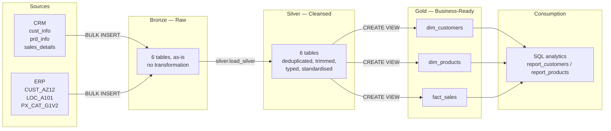
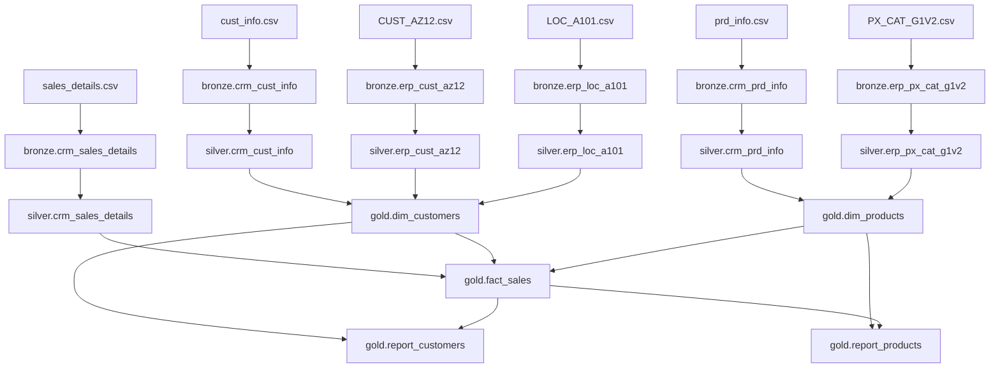
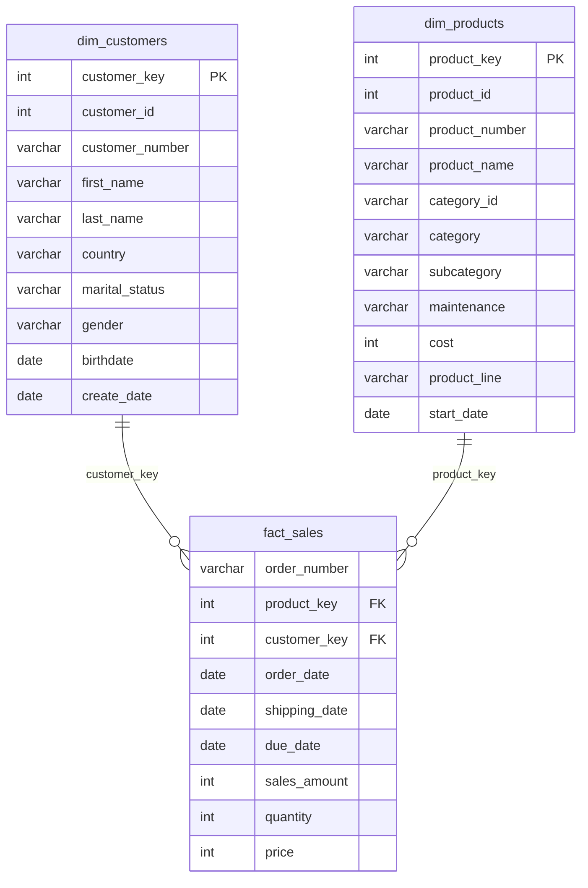

# Data Architecture

The warehouse follows the **Medallion Architecture**: three layers, each with a single responsibility, each consuming only the layer directly below it.

## Layer responsibilities

| | Bronze | Silver | Gold |
|---|---|---|---|
| **Purpose** | Faithful landing zone | Cleansing and conforming | Business consumption |
| **Object type** | Tables | Tables | Views |
| **Transformation** | None | Dedup, trim, type-cast, standardise, derive | Joins, surrogate keys, segmentation |
| **Load method** | `BULK INSERT`, full refresh | Stored procedure, full refresh | Recomputed on query |
| **Audience** | Data engineers | Data engineers, analysts | Analysts, BI tools, stakeholders |

### Why bronze doesn't clean anything

Every value in the warehouse needs to be traceable back to the exact CSV row it came from. If bronze applied cleaning logic, that traceability breaks the moment a cleaning rule has a bug — there's no way to tell whether bad data came from the source or from the transformation. That's why raw sales dates land in bronze as plain integers (e.g. `20101229`) instead of proper dates — the invalid ones need to survive long enough for silver to actually validate and fix them, rather than being silently reshaped on the way in.

### Why gold is views, not tables

Gold doesn't introduce new data — it renames columns, joins silver tables together, and assigns surrogate keys. Making these physical tables would mean storing the same data twice and adding a second refresh step that could drift out of sync with silver. As views, they recompute on every read, so they're always guaranteed to match the layer underneath them.

The trade-off is query cost: `fact_sales` joins two dimension views every time it's queried. At this project's scale (27,659 orders, 60,423 units) that's negligible. At real production volume, the fix would be materializing gold into tables loaded by a `gold.load_gold` procedure — same object names, so nothing downstream (reports, BI tools) would need to change.

## Data flow

## Star schema

`fact_sales` sits at the centre, referencing two conformed dimensions by surrogate key.

## Key integration decisions

**Customer keys differ across all three sources.** CRM uses a key like `AW00011000`, the ERP customer table prefixes it with `NAS`, and the ERP location table hyphenates it (`AW-00011000`). Silver strips the `NAS` prefix and removes hyphens so all three conform to the CRM key, which is treated as the master identifier.

**Gender is mastered by CRM, with ERP as fallback.** Both systems capture gender and they sometimes disagree. `gold.dim_customers` uses the CRM value by default and only falls back to the ERP value when CRM has none — rather than trusting ERP first or trying to reconcile conflicts.

**Product category isn't an explicit foreign key — it's embedded in the key itself.** The first 5 characters of `prd_key` in CRM double as the category ID used in the ERP category table. Silver extracts that substring into `cat_id` and normalizes the separator so it joins cleanly against `erp_px_cat_g1v2.id`.